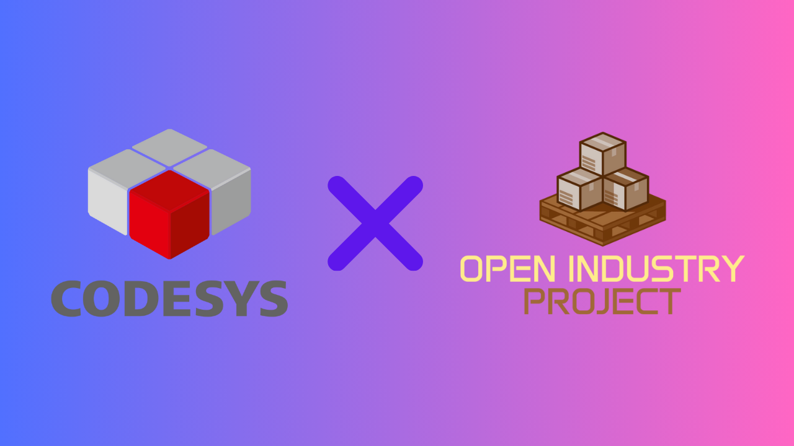

# Introduction
Industrial automation is everywhere around us—from packaging lines in factories to baggage handling systems at airports—and one of the most common elements in these systems is the conveyor belt. To truly understand how automation works in industries, I decided to create a conveyor belt simulation using Codesys together with resources from the Open Industry Project.

The goal of this project was not only to simulate the movement of a conveyor system but also to practice real-world PLC programming concepts such as sensor integration, motor control, and safety interlocks. By working on this project, I gained hands-on experience with structured programming in Codesys, explored how open-source tools can accelerate learning, and developed a deeper appreciation for the role of simulation in industrial automation.

In this post, I’ll walk you through the setup, the implementation process, the challenges I faced, and what I learned while building this simulation.

# Motivation
Getting started with industrial automation can be challenging, mainly because the hardware and software are expensive. A basic PLC setup with I/O modules, sensors, and actuators can cost hundreds or even thousands of euros, and many industrial software platforms require paid licenses. For student or someone just exploring the field that's nor always realistic.

To overcome this, I looked for tools that are free and open-source but still close to real-world industry standards. Codesys is a software platform for developing and managing industrial automation application using IEC 61131-3 (function block diagram, ladder diagram, structured text, etc.) and it is widely used in industry. On the other hand, the Open Industry Project offers open models and resources that replicate common industrial scenarios, like conveyer systems, in virtual environment.

By combining these two, I was able to simulate a realistic conveyer belt control system, complete with sensors, actuators, and safety logic without needing expensive hardware. This gave me a way to practice  PLC programming, test automation concepts, and debug control logice before moving on to real-world implementations. 

# Project Setup
## Tools
### 1. Development Environment - Codesys 
I used Codesys as my PLC programming environment. It comes with built-in SoftPLC, which allowed me to run the PLC program without real hardware. The logic was written using sturtured text.

### 2. Simulation Model - Open Industry Project 
Open Industry Project is a free and open-source project created by the community to provide open framework to create software and simulations using industrial equipments. This software is based on Godot Engine, which is a free and open-source game engine. 

### 3. Communication - OPC UA
OPC UA is a type of industrial communication protocol that enables secure and reliable data exchange between different devices and systems in industrial automation environments. For this project Codesys acts as OPC UA server and Open Industry Project as client. To identify the node Ids from Codesys, I used UaExpert. 

# Implementation
The goal for this project is to control and simulate conveyer belt behaviour using Codesys and Open Industry Project. To eplain the process clearly, I've divided this section into three parts:

## 1. Open Industry Project Simulation
Open Industry Project provides various simulation models, from sensors, conveyer belts, etc, which can be found in Parts tab below. These models can be used easily by dragging the models into the scene.   
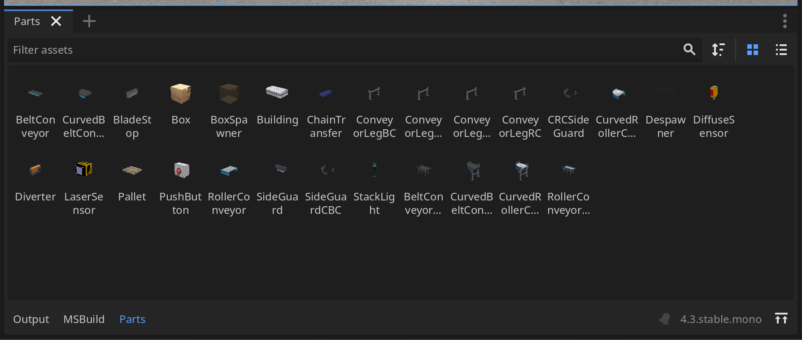

For a simple conveyer belt simulation, I need a conveyer belt, a start and stop buttons, a box and a distance sensor, which are arranged as shown below. The box is used as indicator how the conveyer belt behaves. 
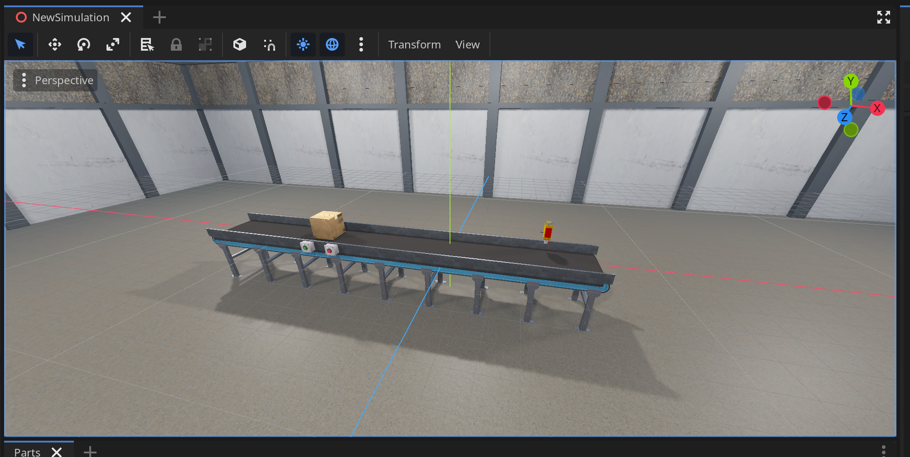

## 2. Codesys 
In Codesys, I wrote the control logic using **Stuctured Text (ST)**, which is written in PLC_PRG (PRG). 
- **Inputs:** iSensor, iStartButton, iStopButton
- **output:** qConveyer, qStartLamp, qStopLamp

```
IF (iSensor OR iStopButton) THEN
	qConveyer := 0.0;
	
	qStartLamp := FALSE;
	qStopLamp := TRUE;
ELSIF iStartButton THEN
	qConveyer := 1.0;
	
	qStartLamp := TRUE;
	qStopLamp := FALSE;
END_IF
```
To upload the program the SoftPLC need to started first and connect it to Codesys.
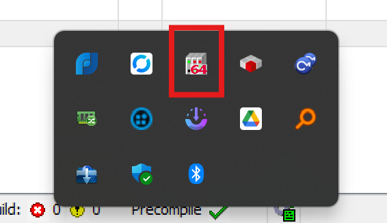
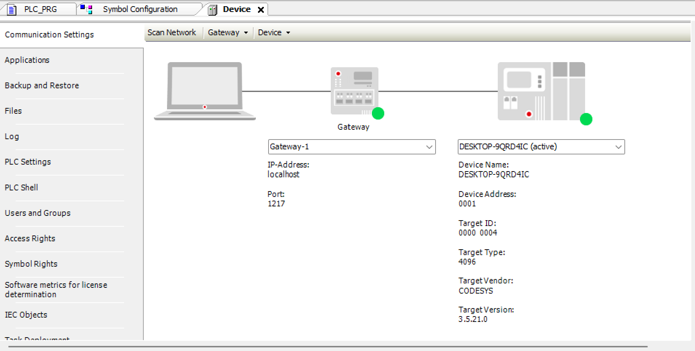

## 3. Communication and Connection
As already mention in the Project Setup, the communication between Codesys and Open Industry Project is done by using OPC UA. To setup the OPC UA server in Codesys side, I added a new object called **Symbol Configuration** and expose my PLC variables inside PLC_PRG (PRG) as OPC UA nodes.
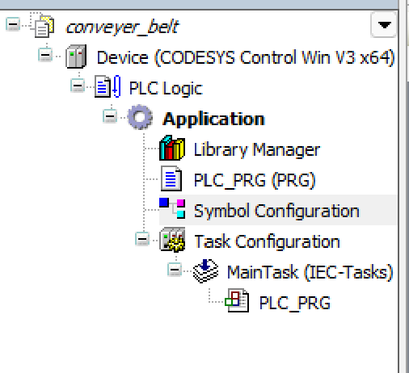
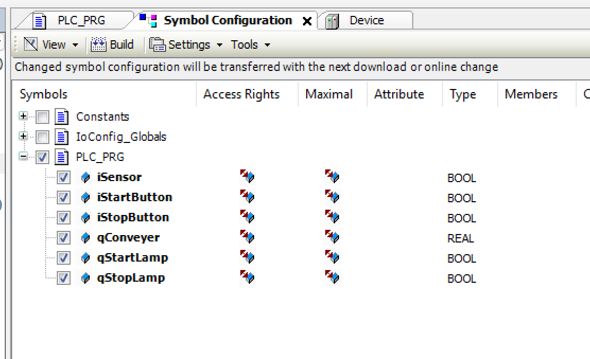

To identify the correct Node Id, I used UaExpert,an OPC UA client software from Unified Automation. The process was:
1. Open UaExpert and add a new server connection.
2. Enter the Codesys OPC UA server endpoint (e.g., opc.tcp://your-pc-name:4840).
3. Once connected, browse through the address space to find the variables I created in Codesys.
4. Note the Node IDs of each variable. These IDs are necessary for mapping the I/O between Codesys and the Open Industry Project model.
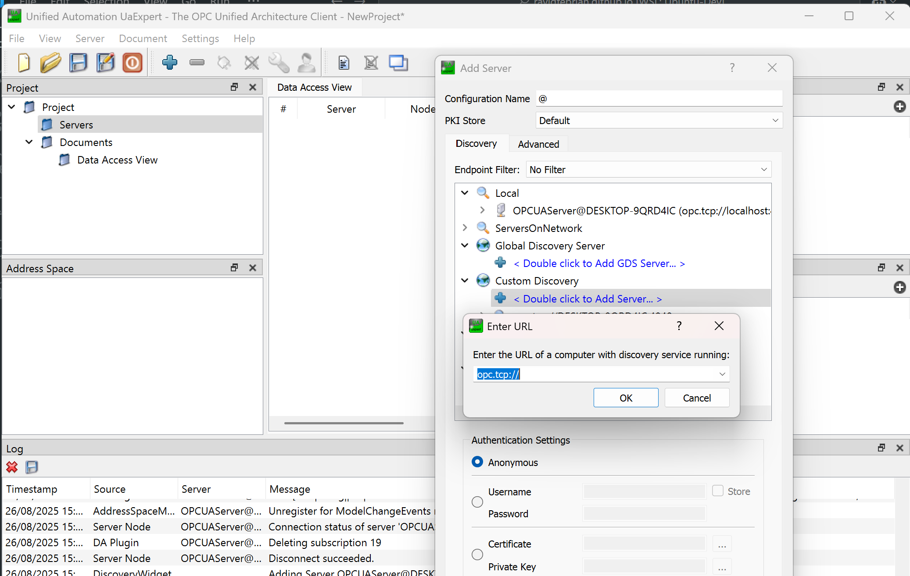
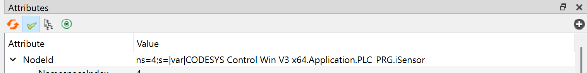

In Open Industry Project side, the configuration was:
1. Click the Main node and select OPC UA as the communication protocol 
2. Add the same OPC UA server endpoint as the one in UaExpert.
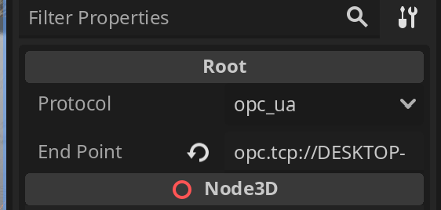
3. Select a component you want to connect (for example, the Start button) 
4. Enable the Enable Comms option. Then
5.  paste the corresponding Node Id into the tags field.
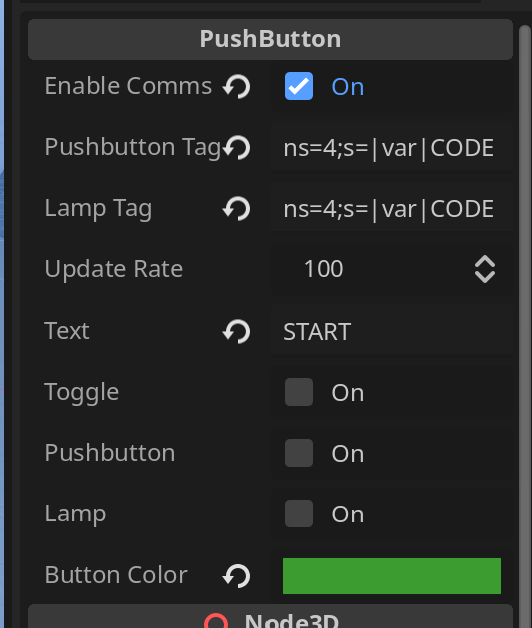

By repeating this process for each component, I successfully linked the simulation model with my Codesys logic. Once mapped, pressing a virtual button in the Open Industry Project instantly triggered the PLC logic in Codesys, and the conveyor responded in real time.

## Demos





# Conclussion
One of the biggest challenges I faced during this project was the lack of detailed documentation from the Open Industry Project. This means I had to experimenting how to properly connect the server and map the variables to the simulating components. Most of the setup was done through trial and error rather than following clear guidelines.

Another limitation is that the available models are still quite limited. While the conveyor system works well as a starting point, the lack of variety restricts how much you can simulate out of the box. For example, more advanced components like diverters, sorting mechanisms, or robotic arms are not yet included, which limits the complexity of scenarios. It is possible to add your own models, but it requires writing custom scripts, which adds another layer of complexity.

Despite these challenges, I found that Open Industry Project haa huge potential as a learning material -both for students and someone who wants to explore about industrial automation concepts without expensive hardware. It also provides a safe way to test and implement ideas before deploying them to real production lines, which can save both time and cost in actual projects.

Working through the limitations also gave me a much better understanding of OPC UA communication and how simulation environments can be extended beyond their default features. In the end, the extra effort turned into valuable hands-on learning.

# Sources
- [Codesys](https://www.codesys.com/)
- [Open Industry Project](https://github.com/Open-Industry-Project/Open-Industry-Project)
- [UaExpert](https://www.unified-automation.com/products/development-tools/uaexpert.html)


